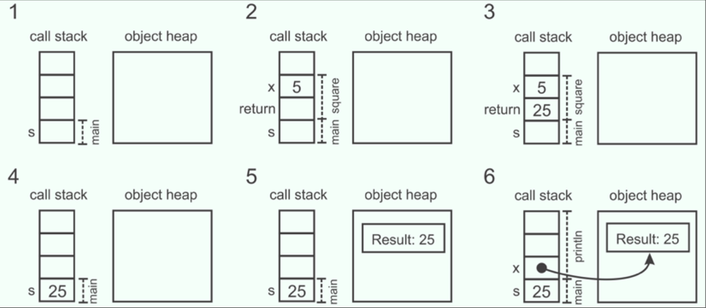

# Chapter 1

- [Chapter 1](#chapter-1)
  - [Preface](#preface)
  - [Execution of a Scala Program](#execution-of-a-scala-program)
  - [Summary](#summary)

## Preface

In concurrent programming, we express a program as a set of concurrent computations that execute during overlapping time intervals and coordinate in some way. Implementing a concurrent program that functions correctly is usually much harder than implementing a sequential one.

This chapter explains the basics of concurrent computing and presents some Scala preliminaries required for this book. Specifically, it does the following:
• Shows a brief overview of concurrent programming
• Studies the advantages of using Scala when it comes to concurrency
• Covers the Scala preliminaries required for reading this book

Concurrent programming has multiple advantages:

- First, increased concurrency can improve program performance. Instead of executing the entire program on a single processor, different subcomputations can be performed on separate processors making the program run faster.
- Concurrency can ensure the improved responsiveness of a program that interacts with the environment.
- Finally, concurrency can simplify the implementation and maintainability of computer programs. Some programs can be represented more concisely using concurrency.

> Coordination of multiple executions in a concurrent system is called synchronisation, and it is a key part in successfully implementing concurrency. Synchronisation includes mechanisms used to order concurrent executions in time. Furthermore, synchronisation specifies how concurrent executions communicate, that is, how they exchange information.

For concurrent programming different the way executions interact with each other is by modifying the shared memory subsystem on the machine, this is called: "Shared Memory Communication". For distributed programs, on the other hand, executions interact by exchanging messages, this is called: "Message Passing Communication".

## Execution of a Scala Program

When a Scala program runs, the JVM runtime allocates the memory required for the program. Here, we consider two important memory regions: the **call stack** and the **object heap**.

The call stack is a region of memory in which the program stores information about the local variables and parameters of the currently executed methods. The object heap is a region of memory in which the objects are allocated by the program.

1. The program allocates an entry to the call stack for the local variable `s`.
2. It calls the square method to compute the value for the local variable `s`. The program places the value 5 on the call stack, which serves as the value for the x parameter. It also reserves a stack entry for the return value of the method.
3. At this point, the program can execute the square method, so it multiplies the x parameter by itself, and places the return value 25 on the stack.
4. After the square method returns the result, the result 25 is copied into the stack entry for the local variable `s`.
5. Now, the program must create the string for the `println` statement. In Scala, strings are represented as object instances of the String class, so the program allocates a new String object to the object heap.
6. Finally, the program stores the reference to the newly allocated object into the stack entry x, and calls the `println` method.

## Summary

In this chapter, we studied what concurrent programming is and why Scala is a good language for concurrency. In the next chapter, we will start with the fundamentals of concurrent programming on the JVM. We will introduce the basic concepts in concurrent programming, present the low-level concurrency utilities available on the JVM, and learn about
the Java Memory Model.
